# Design Document

## Table of Contents
1. [Domain Model](#1-domain-model)
2. [System Sequence Diagrams](#2-system-sequence-diagrams)
3. [Design Class Model](#3-design-class-model)
4. [Internal Sequence Diagrams](#4-internal-sequence-diagrams)

## 1. Domain Model

## 2. System Sequence Diagrams

### Main System Sequence Diagrams
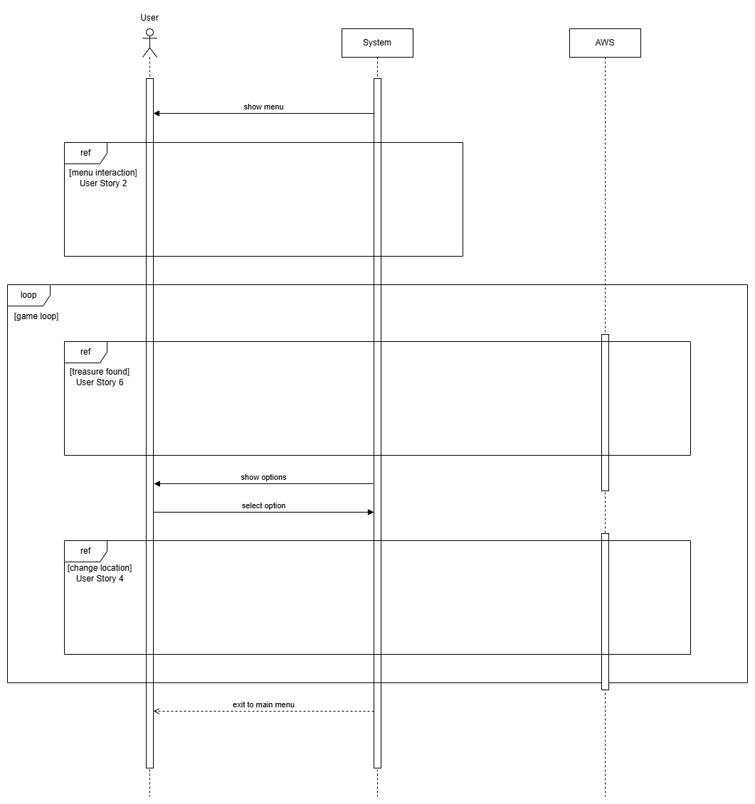

### System Sequence Diagram for User Story 1
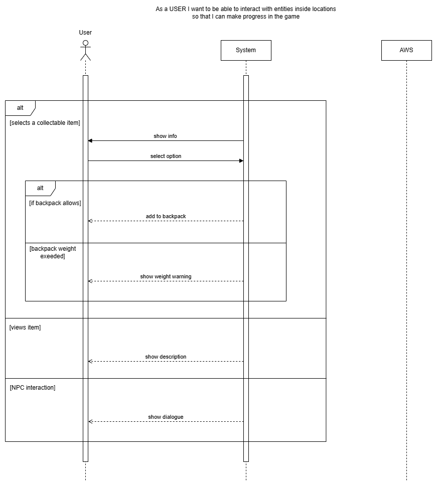

### System Sequence Diagram for User Story 2
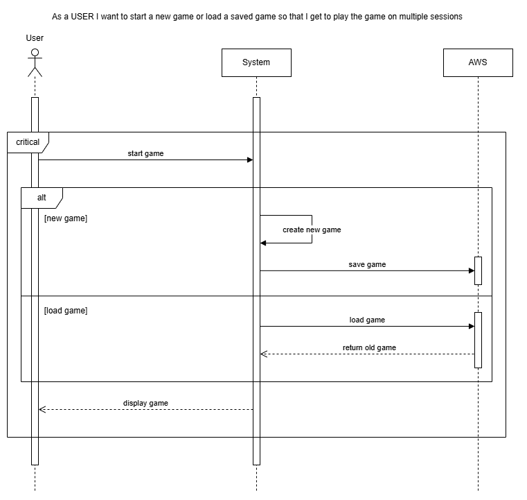

### System Sequence Diagram for User Story 3
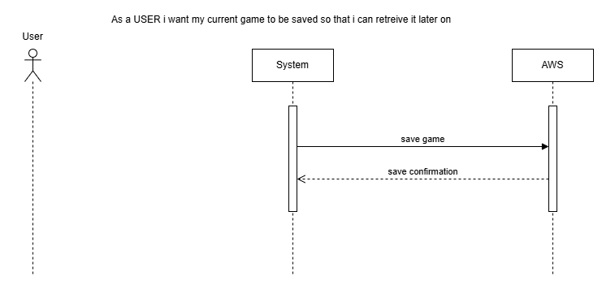

### System Sequence Diagram for User Story 4
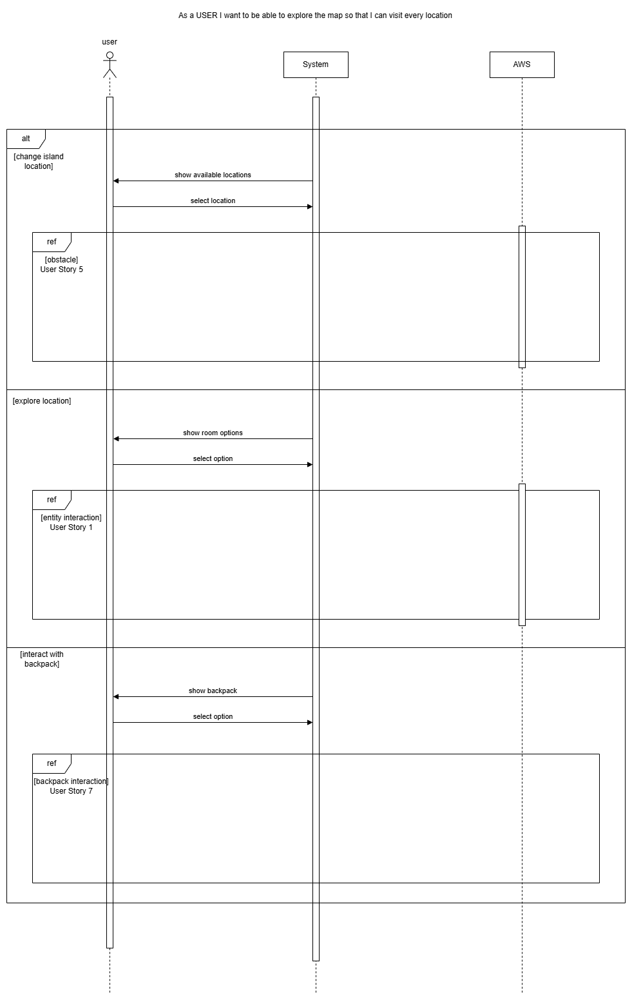

### System Sequence Diagram for User Story 5
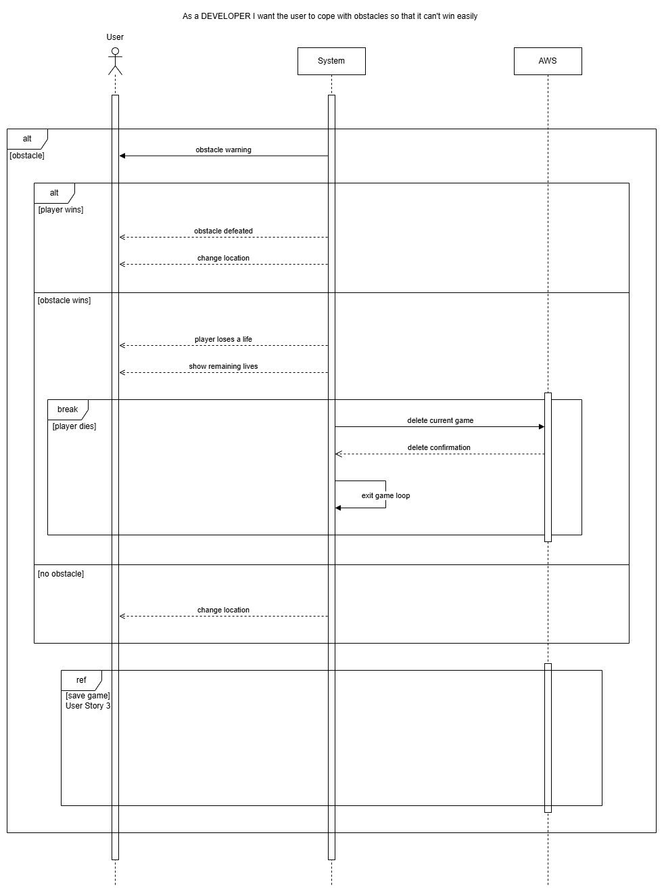

### System Sequence Diagram for User Story 6
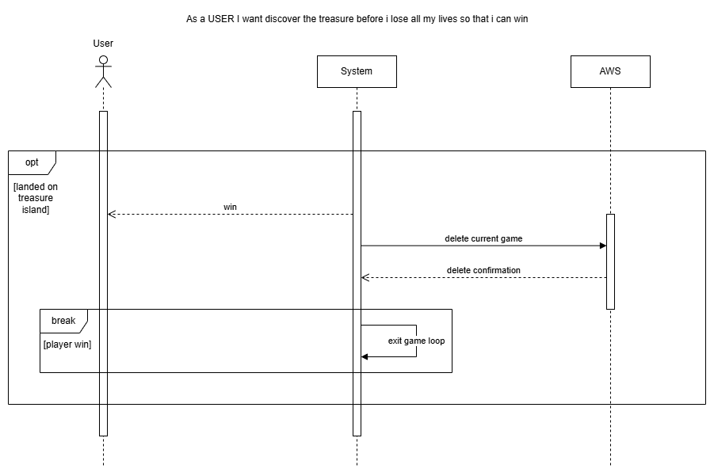

### System Sequence Diagram for User Story 7
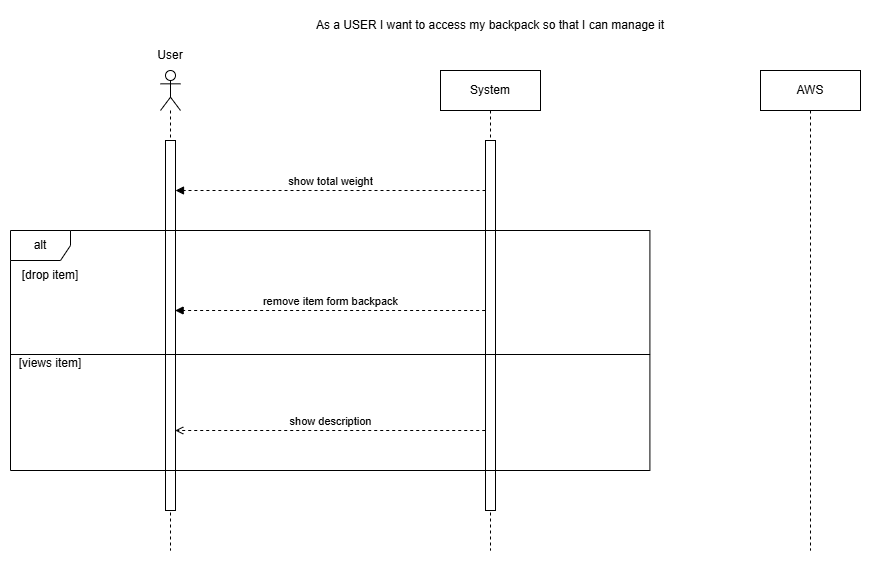
 
## 3. Design Class Model

## 4. Internal Sequence Diagrams

### Internal Sequence Diagram for HandleUserInput
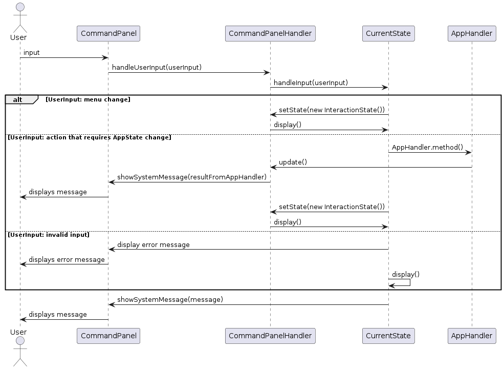

### Internal Sequence Diagram for Move
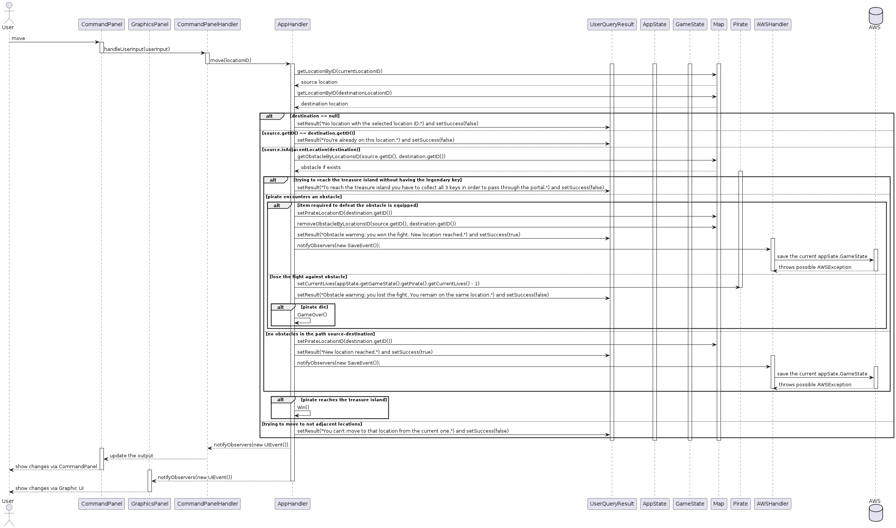

### Internal Sequence Diagram for PickUpItem
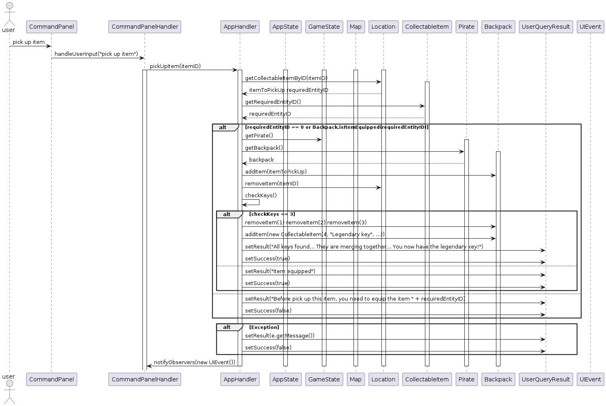

### Internal Sequence Diagram for StartSavedGame
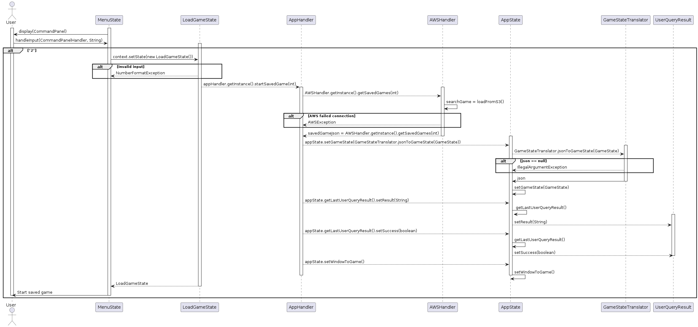