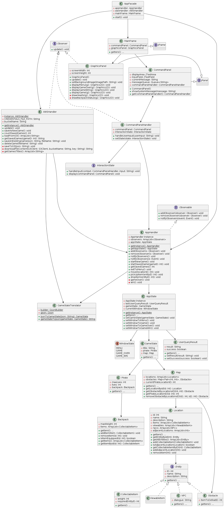

# Design Document

## Table of Contents
1. [Domain Model](#1-domain-model)
2. [System Sequence Diagrams](#2-system-sequence-diagrams)
3. [Design Class Model](#3-design-class-model)
4. [Internal Sequence Diagrams](#4-internal-sequence-diagrams)

## 1. Domain Model

## 2. System Sequence Diagrams

## 3. Design Class Model

## 4. Internal Sequence Diagrams
